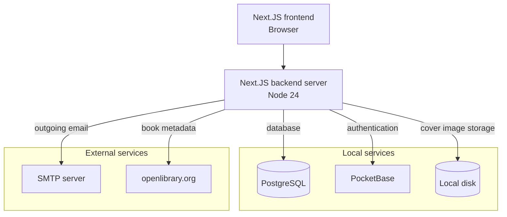

  <picture>
    <source media="(prefers-color-scheme: dark)" srcset="public/logo_text_dark.svg">
    
  </picture>

Alkove is an open source Library Management System with an Online Public Access Catalog. The goal is to be modern, easy to use, and self-hostable for small to medium organizations.

# Features

- Web Interface: Available through the browser, so staff and users can access through mobile, tablet, or desktop devices
- Cataloging: Barcode scanner to read ISBN. Once ISBN is entered, details are pulled from openlibrary.org to automatically populate title, author, cover, and other metadata
- Online Catalog: anyone can browse the book catalog and see featured, popular, and new titles 
- Checkout and Check-in: See availability and track what books are checked out by who
- User Access: Users can optionally create an account and view what books they have checked out or can check books out with a local account. Email not required
- Self-hosted and Open Source: Designed to run on your own machine, with ownership of the whole tech stack

## Technologies

The stack is mostly designed to be interchangeable, but here's the stack it uses by default:

### Next.JS server

- Handles webserver frontend and backend. Runs on NodeJS 24

### PocketBase

- Handles authentication. Storing passwords, rate limiting, generating/validating tokens.

### Outgoing Email

- SMTP client Nodemailer running on Next.JS backend. Will require SMTP credentials to send emails for creating accounts.

### Database

- Docker compose file to set up a PostgreSQL database. Connections are handled with Prisma so any database type can be used.

### Openlibrary.org

Cover and book metadata is fetched from Openlibrary by ISBN. Once saved, the covers and metadata are stored on disk and served from our server, so openlibrary.org is only needed for the automatic fetching of data initially.

## Getting It Running

Take a look at the SETUP.md guide

## Using the Application

Logging in as an administrator will show you the Admin Dashboard. From there you can view various logs and data. From the Admin Users page you can create additional staff and administrator accounts (Users -> Create). Admins also have access to all staff actions.

Logging in as a staff will show you the Staff Dashboard. From there you can create books (Books -> Create), check books in and out, and create local and web users (Users -> Create)

The OPAC will be viewable without an account at the root of the hosted domain.

Additional information can be found in the User Guide on the Staff Dashboard.